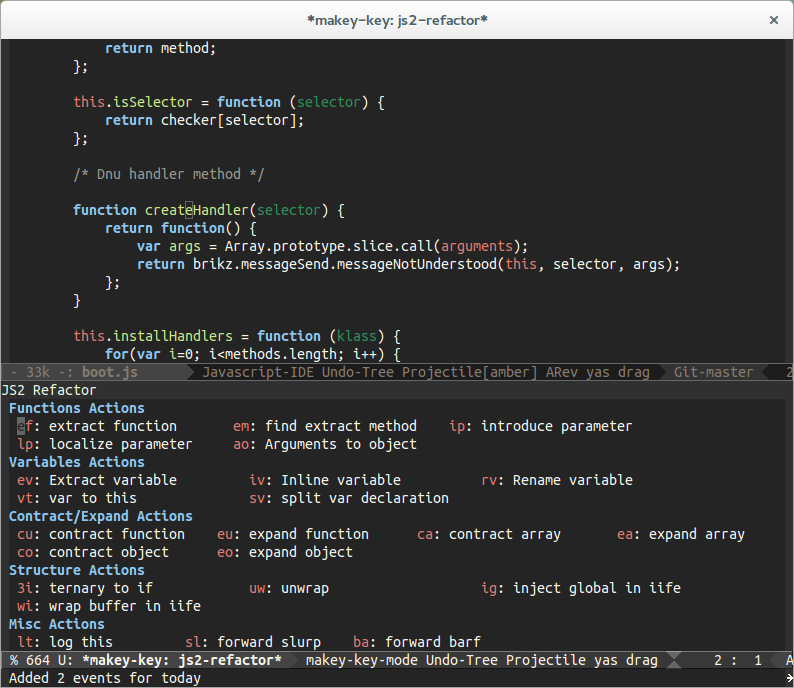

discover-js2-refactor
=====================

Adds a [discover](https://github.com/mickeynp/discover.el) context
menu to [js2-refactor](https://github.com/magnars/js2-refactor.el).

## Screenshot

## Installation

If you have [melpa](http://melpa.milkbox.net/#/) enabled, simply evaluate

    (package-install 'discover-js2-refactor)

